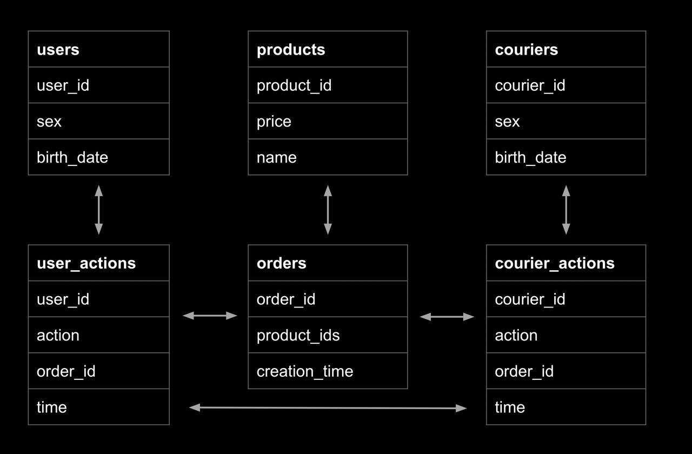
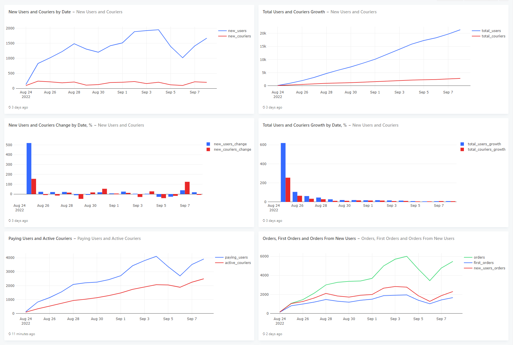
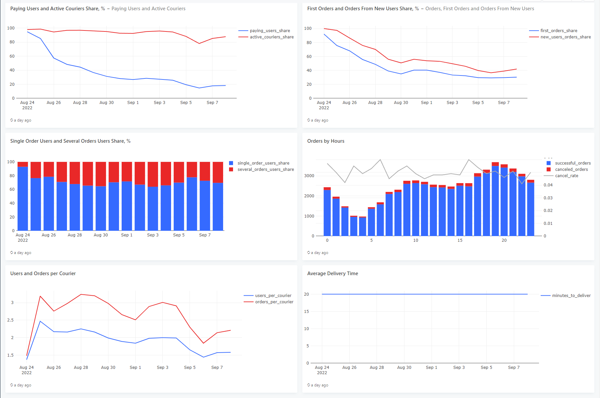

# My Analytical Tasks Portfolio
📌 **В данном проекте проводим анализ нашего сервиса и рассчитываем несколько важных показателей, характеризующих его работу.** 

📌**Будем писать SQL-запросы и визуализировать их результат с помощью графиков в _Redash_.**

📌**В конце проекта из всех построенных графиков будет собран дашборд.**

------------

 ## 🔵 Схема, структура и наполнение таблиц базы данных нашего сервиса
**Типы данных:** В таблицах могут храниться разные типы данных: целые и дробные числа, текст, даты, массивы из чисел. 

**🔷Структура и наполнение таблиц:** 

**🔸user_actions** — действия пользователей с заказами.

| Столбец  | Тип данных  | Описание                                                                                          |
|----------|-------------|---------------------------------------------------------------------------------------------------|
| user_id  | INT         | id пользователя                                                                                   |
| order_id | INT         | id заказа                                                                                         |
| action   | VARCHAR(50) | действие пользователя с заказом; 'create_order' — создание заказа, 'cancel_order' — отмена заказа |
| time     | TIMESTAMP   | время совершения действия                                                                         |

**🔸courier_actions** — действия курьеров с заказами.

| Столбец    | 	Тип данных | 	Описание                                                                                        |
|------------|-------------|--------------------------------------------------------------------------------------------------|
| courier_id | 	INT	id     | курьера                                                                                          |
| order_id   | INT	        | id заказа                                                                                        |
| action     | VARCHAR(50) | 	действие курьера с заказом; 'accept_order' — принятие заказа, 'deliver_order' — доставка заказа |
| time	      | TIMESTAMP   | 	время совершения действия                                                                       |

**🔸orders** — информация о заказах.

| Столбец	      | Тип данных | 	Описание                  |
|---------------|------------|----------------------------|
| order_id	     | INT	       | id заказа                  | 
| reation_time	 | TIMESTAMP	 | время создания заказа      |
| product_ids	  | integer[]	 | список id товаров в заказе |

**🔸users** — информация о пользователях.

| Столбец	     | Тип данных   | 	Описание                                 |
|--------------|--------------|-------------------------------------------|
| user_id 	    | INT 	        | id пользователя                           |
| birth_date 	 | DATE	        | дата рождения                             |
| sex 	        | VARCHAR(50)	 | пол; 'male' — мужской, 'female' — женский |

**🔸couriers** — информация о курьерах.

| Столбец	   | Тип данных	  | Описание                                   |
|------------|--------------|--------------------------------------------|
| courier_id | 	INT         | 	id курьера                                |
| birth_date | 	DATE        | 	дата рождения                             |
| sex        | 	VARCHAR(50) | 	пол; 'male' — мужской, 'female' — женский |

**🔸products** — информация о товарах, которые доставляет сервис.

| Столбец	   | Тип данных    | 	Описание       |
|------------|---------------|-----------------|
| product_id | 	INT          | 	id продукта    |
| name       | 	VARCHAR(50)	 | название товара |
| price      | 	FLOAT(4)     | 	цена товара    |

**🔷Схема базы данных:** 

**🔷Данные:**

Данные для наполнения БД использовал с учебной платформы Karpov.Courses.

------------

## 🔵Метрики и графики

 ### **🔷Задача 1:** 

Для начала проанализируем, насколько быстро растёт аудитория нашего сервиса, и посмотрим на динамику числа пользователей и курьеров.

**🔷Пояснение:** Для каждого дня, представленного в таблицах _**user_actions**_ и _**courier_actions**_, рассчитаем следующие показатели:

1. Число новых пользователей.
2. Число новых курьеров.
3. Общее число пользователей на текущий день.
4. Общее число курьеров на текущий день.

Колонки с показателями назовём **new_users, new_couriers, total_users, total_couriers**. Колонку с датами **date**. 

Поля в результирующей таблице: 

* date
* new_users 
* new_couriers
* total_users 
* total_couriers

**🔷Результат:** 

Новыми будем считать тех пользователей и курьеров, которые в данный день совершили своё первое действие в нашем сервисе. Общее число пользователей/курьеров на текущий день — это результат сложения числа новых пользователей/курьеров в текущий день со значениями аналогичного показателя всех предыдущих дней.

**Итоговый** [**SQL-запрос**](https://github.com/kioybash/analytical_tasks/blob/main/SQL_queries/Task_1.sql "**SQL-запрос**").

**🔷Получившийся графики:**

Динамика новых пользователей и курьеров:

Динамика общего числа пользователей:

------------

## 🔵Построение дашбордов

### **🔷Задача 2:** 

Анализируя динамику показателей из предыдущего задания, можно заметить, что сравнивать абсолютные значения не очень удобно. Посчитаем динамику показателей в относительных величинах.

**🔷Пояснение:** 
Дополним запрос из предыдущего задания и теперь для каждого дня, представленного в таблицах **user_actions** и **courier_actions**, дополнительно рассчитаем следующие показатели:

1. Прирост числа новых пользователей.
2. Прирост числа новых курьеров.
3. Прирост общего числа пользователей.
4. Прирост общего числа курьеров.

Показатели, рассчитанные на предыдущем шаге, также включим в результирующую таблицу.

Колонки с новыми показателями назовём **new_users_change, new_couriers_change, total_users_growth, total_couriers_growth**. Колонку с датами **date**.

Поля в результирующей таблице: 

* date 
* new_users 
* new_couriers 
* total_users 
* total_couriers
* new_users_change 
* new_couriers_change 
* total_users_growth 
* total_couriers_growth

**🔷Результат:** 
 
**Итоговый** [**SQL-запрос**](https://github.com/kioybash/analytical_tasks/blob/main/SQL_queries/Task_2.sql "**SQL-запрос**").

**🔷Получившийся графики:**

Динамика прироста числа новых пользователей и курьеров:

Динамика прироста общего числа пользователей и курьеров: 

------------

### **🔷Задача 3:** 
Теперь посмотрим на нашу аудиторию немного под другим углом — посчитаем не просто всех пользователей, а именно ту часть, которая оформляет и оплачивает заказы в нашем сервисе. 

Заодно выясним, какую долю платящие пользователи составляют от их общего числа.

**🔷Пояснение:** 
Для каждого дня, представленного в таблицах **user_actions** и **courier_actions**, рассчитаем следующие показатели:

1. Число платящих пользователей.
2. Число активных курьеров.
3. Долю платящих пользователей в общем числе пользователей на текущий день.
4. Долю активных курьеров в общем числе курьеров на текущий день.

Колонки с показателями назовем соответственно **paying_users, active_couriers, paying_users_share, active_couriers_share**. Колонку с датами назовём **date**.

Поля в результирующей таблице: 

* date
* paying_users
* active_couriers
* paying_users_share
* active_couriers_share

**🔷Результат:** 

Платящими будем считать тех пользователей, которые в данный день оформили хотя бы один заказ, который в дальнейшем не был отменен.

Курьеров будем считать активными, если в данный день они приняли хотя бы один заказ, который был доставлен (возможно, уже на следующий день), или доставили любой заказ.

**Итоговый** [**SQL-запрос**](https://github.com/kioybash/analytical_tasks/blob/main/SQL_queries/Task_3.sql "**SQL-запрос**").

**🔷Получившийся графики:**

Динамика платящих пользователей и активных курьеров:

Динамика долей платящих пользователей и активных курьеров:

------------

### **🔷Задача 4:** 

Теперь подробнее остановимся на платящих пользователях, копнём немного глубже и выясним, как много платящих пользователей совершают более одного заказа в день. 

В конце концов нам важно понимать, как в большинстве своём ведут себя наши пользователи — они заходят в приложение, чтобы сделать всего один заказ, или же наш сервис настолько хорош, что они готовы пользоваться им несколько раз в день.

**🔷Пояснение:** 

Для каждого дня, представленного в таблице user_actions, рассчитаем следующие показатели:

1. Долю пользователей, сделавших в этот день всего один заказ, в общем количестве платящих пользователей.
2. Долю пользователей, сделавших в этот день несколько заказов, в общем количестве платящих пользователей.

Колонки с показателями назовём **single_order_users_share, several_orders_users_share.** Колонку с датами **date**. 

Поля в результирующей таблице: 

* date 
* single_order_users_share
* several_orders_users_share

**🔷Результат:** 

**Итоговый** [**SQL-запрос**](https://github.com/kioybash/analytical_tasks/blob/main/SQL_queries/Task_4.sql "**SQL-запрос**").

**🔷Получившийся график:**

Доли пользователей с одним и несколькими заказами:

------------

### **🔷Задача 5:** 

Продолжим изучать наш сервис и рассчитаем несколько показателей, связанных с заказами.

**🔷Пояснение:** 

Для каждого дня, представленного в таблице user_actions, рассчитаем следующие показатели:

1. Общее число заказов.
2. Число первых заказов (заказов, сделанных пользователями впервые).
3. Число заказов новых пользователей (заказов, сделанных пользователями в тот же день, когда они впервые воспользовались сервисом).
4. Долю первых заказов в общем числе заказов (долю п.2 в п.1).
5. Долю заказов новых пользователей в общем числе заказов (долю п.3 в п.1).

Колонки с показателями назовём **orders, first_orders, new_users_orders, first_orders_share, new_users_orders_share.** Колонку с датами **date.** 

Поля в результирующей таблице: 

* date
* orders
* first_orders
* new_users_orders
* first_orders_share
* new_users_orders_share

**🔷Результат:** 

**Итоговый** [**SQL-запрос**](https://github.com/kioybash/analytical_tasks/blob/main/SQL_queries/Task_5.sql "**SQL-запрос**").

**🔷Получившийся графики:**

Динамика общего числа заказов, числа первых заказов и числа заказов новых пользователей:

Динамика доли первых заказов и доли заказов новых пользователей в общем числе заказов:

------------

### **🔷Задача 6:** 

Теперь попробуем оценить нагрузку на наших курьеров и узнаем, сколько в среднем заказов и пользователей приходится на каждого из них.

**🔷Пояснение:** 

На основе данных в таблицах user_actions, courier_actions и orders для каждого дня рассчитаем следующие показатели:

1. Число платящих пользователей на одного активного курьера.
2. Число заказов на одного активного курьера.

Колонки с показателями назовём **users_per_courier** и **orders_per_courier**. Колонку с датами **date**. 

Поля в результирующей таблице: 

* date 
* users_per_courier
* orders_per_courier

**🔷Результат:** 

**Итоговый** [**SQL-запрос**](https://github.com/kioybash/analytical_tasks/blob/main/SQL_queries/Task_6.sql "**SQL-запрос**").

**🔷Получившийся график:**

Динамика числа пользователей и заказов на одного курьера:

------------

### **🔷Задача 7:**
Рассчитаем ещё один полезный показатель, характеризующий качество работы курьеров.

**🔷Пояснение:** 
На основе данных в таблице **courier_actions** для каждого дня рассчитаем, за сколько минут в среднем курьеры доставляли свои заказы.

Колонку с показателем назовём **minutes_to_deliver**. Колонку с датами **date**.

Поля в результирующей таблице: 

* date
* minutes_to_deliver

**🔷Результат:** 

Некоторые заказы оформляют в один день, а доставляют уже на следующий. При расчёте среднего времени доставки в качестве дней, для которых считать среднее, будем использовать дни фактической доставки заказов.

**Итоговый** [**SQL-запрос**](https://github.com/kioybash/analytical_tasks/blob/main/SQL_queries/Task_7.sql "**SQL-запрос**").

**🔷Получившийся график:**

Динамика среднего времени доставки заказов:

------------

### **🔷Задача 8:** 

И наконец, оценим почасовую нагрузку на наш сервис, выясним, в какие часы пользователи оформляют больше всего заказов, и заодно проанализируем, как изменяется доля отмен в зависимости от времени оформления заказа.

**🔷Пояснение:** 

На основе данных в таблице **orders** для каждого часа в сутках рассчитаем следующие показатели:

1. Число успешных (доставленных) заказов.
2. Число отменённых заказов.
3. Долю отменённых заказов в общем числе заказов (cancel rate).

Колонки с показателями назовём **successful_orders, canceled_orders, cancel_rate**. Колонку с часом оформления заказа назовём **hour**. 

Поля в результирующей таблице: 

* hour
* successful_orders
* canceled_orders
* cancel_rate

**🔷Результат:** 

**Итоговый** [**SQL-запрос**](https://github.com/kioybash/analytical_tasks/blob/main/SQL_queries/Task_8.sql "**SQL-запрос**").

**🔷Получившийся график:**

Динамика показателя cancel rate и числа успешных/отменённых заказов:

------------

## 🔵Построение дашборда

Мы посчитали уже много разных показателей и построили достаточно графиков, чтобы собрать из них полноценный дашборд:

